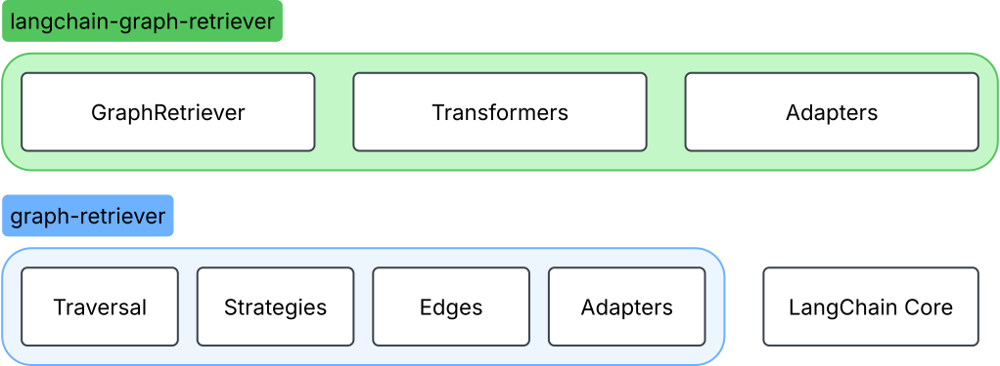

# Guide

Graph RAG provides the ability to traverse content in a vector store based on relationships in the metadata.
The traversal may start from specific nodes or use vector search to find the best starting places (or both).
Each traversal may define a different way to use the metadata to relate information, allowing different calls to traverse to focus on different properties.

A variety of traversal strategies are supported, allowing the specific nodes selected during traversal to be controlled depending on the goals.
In some cases, it is important to find deeper supporting content, while in others finding a broader set of relevant perspectives is more appropriate.

This guide provides an overview of the key concepts and the components provided by the project.

!!! tip "In a hurry to get started?"

    Go to the [Getting Started Guide](get-started.md) to jump in!

## Packages and Components

The Graph RAG project primarily consists of two Python packages:

- [`graph_retriever`](../reference/graph_retriever/index.md) provides the core
traversal functions in a framework independent way.
    - [Traversal](traversal.md): The primary methods `traverse` and `atraverse` for performing the graph traversal.
    - [Strategies](strategies.md): Configurable and customizable strategies for selecting nodes to visit.
    - [Edges](edges.md): Configurable and customizable specification of relationships between nodes.
    - [Adapters](adapters.md): Interface used to interact with a Vector Store.

- [`langchain_graph_retriever`](../reference/langchain_graph_retriever/index.md)
is built on it and integrates with LangChain to allow graph retrieval on LangChain
supported Vector Stores.

    - [GraphRetriever](traversal.md#graph-retriever): A LangChain Retriever for performing the traversal. Uses `traverse` and `atraverse` under the hood.
    - [Transformers](transformers.md): A variety of LangChain document transformers adding metadata that may be useful for traversing.
    - [Adapters](adapters.md): Adapter implementations for LangChain Vector Stores.